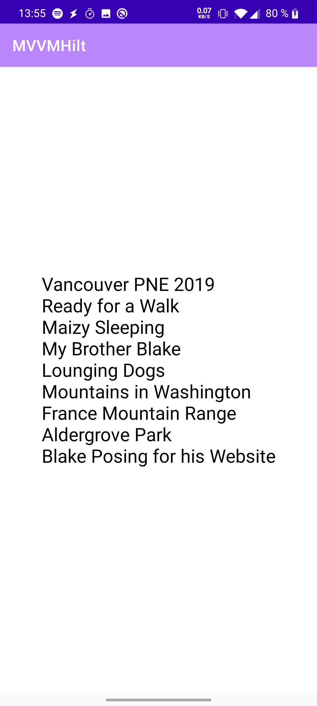

# MVVMHilt

## Description

This app is the result of the really nice tutorial from Mitch Tabian about hilt integration. <a href="https://bit.ly/2ZSblrn">Youtube Tutorial</a>

## Technologies used

- Kotlin
- MVVM/MVI
- Coroutine/Flow
- Dagger/Hilt
- Room
